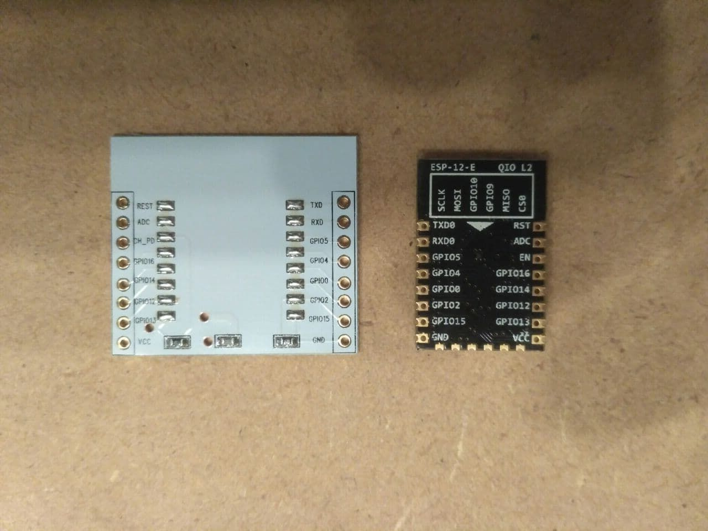

# ESP8266_BMP280
## Pressure sensor with 2 BMP280 using an ESP8266

This project tries to connect 2 BMP280 to an ESP8266.

Google says: The pressure in water increases by 1bar for every 10m depth.
Ambient pressure is 1 bar typically and changes with weather.
So we need to measure a pressure of up to 2 bar, and correct for ambient pressure variations.
(1 bar = 100kPa = 1000hPa).
The 1100hPa (=110kPa) is therefore sufficient to measure 1m Water. We will see how much depth the sensor is able to measure. 

## BMP280

Datasheet for the BMP280 is here: https://www.bosch-sensortec.com/products/environmental-sensors/pressure-sensors/bmp280/#documents

Rated 300..1100hPa (9000m above ... 500m below sea level) (or 1m of water @ sea level)

Voltage: 1,8V typ, max 3.6V (so 3.3V should be fine)

The BMP280 has a combined I2C/SPI interface. By default it's I2C, until the CS is pulled low once, from then it's SPI until the next reset.
I'm going to use it in I2C mode.
The chip contains factory programmed calibration data, which is read only and never changes. These values are safe to be read on startup, and be used for calculation thereafter.
Bosch recommends to use their calculation code on https://github.com/BoschSensortec/BMP2-Sensor-API

## ESP12E

My ESP8266 version is an ESP12E, mounted to one of those white boards that are prepared for a Holtek HT7333 3,3V LDO.
However, I may use an external 3,3V regulator, as the board has no 3,3V output needed for the BMP280s, and I have those boards laying around anyway.

Quickstart-Guides [here](https://www.instructables.com/Getting-Started-with-the-ESP8266-ESP-12/) (on my board GPIO5/4 are switched) and [here](https://bennthomsen.wordpress.com/iot/iot-things/esp8266-wifi-soc/esp8266-getting-started-with-arduino-ide/). Some quirks are discribed unter https://www.letscontrolit.com/wiki/index.php/Basics:_ESP8266_Types_and_Boards 

I'm not certain which I2C tutorial I will use, starting points may be
- https://diyi0t.com/i2c-tutorial-for-arduino-and-esp8266/ or
- http://wp.andreas.bieri.name/myblog/2016/07/08/meine-arduino-i2c-tests-blinkm-und-rtc-module/ 
